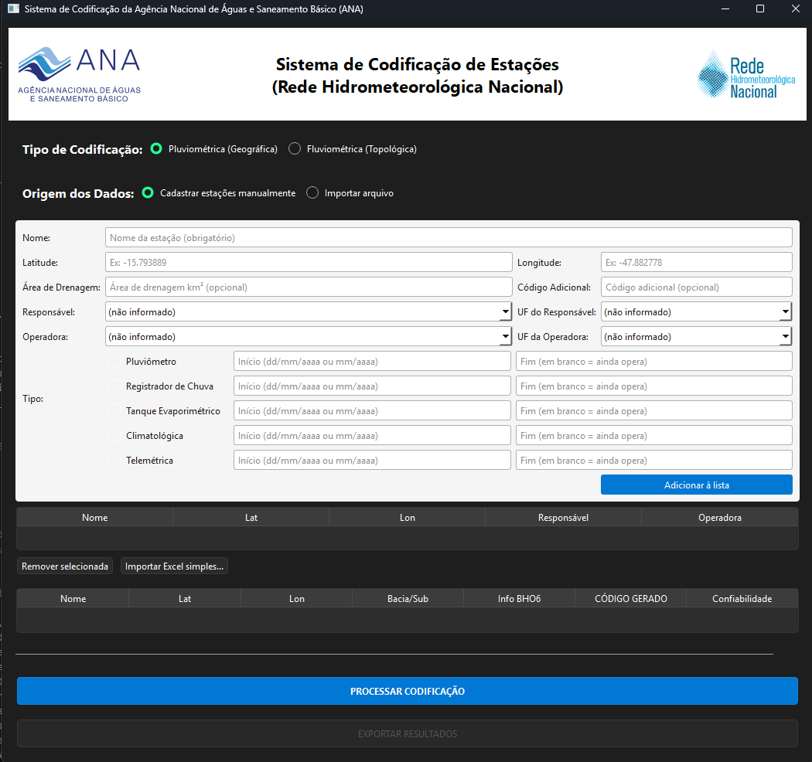

# 🌊 Sistema de Codificação Hidrológica — ANA/SGB


Aplicativo desktop para gerar códigos de estações hidrológicas seguindo o padrão ANA/SGB —
tanto o formato geográfico usado em pluviometria quanto o formato topológico usado em
fluviometria (Base Hidrográfica Ottocodificada — BHO).



## 👉 Se você é operador(a)/servidor(a) da ANA e só quer usar o programa

Não precisa instalar Python nem nada de desenvolvedor. Siga os passos abaixo (ou veja o
[Manual do Usuário em PDF](docs/Manual_do_Usuario.pdf), com todos os detalhes e telas):

1. **Baixe o programa.** Vá até a aba [**Releases**](../../releases) deste repositório e baixe o
   arquivo `.zip` mais recente (algo como `Codificacao_Hidrologica_vX.X.zip`).
2. **Extraia** o `.zip` em uma pasta no seu computador (ex.: `C:\Codificacao_Hidrologica`).
3. **Aponte para a pasta `insumo`** (dados geoespaciais — sub-bacias, malha de rios BHO,
   municípios). Ela não vem no `.zip` por ser grande (~4 GB) e está disponível na rede interna
   da ANA em:
   ```
   \\agencia\ana\SGH\CODIH\Base de Dados Geograficos
   ```
   Duas formas de usar, sem precisar duplicar os 4 GB em cada máquina:
   - **Direto da rede (recomendado)**: no `.env` (veja passo 4), defina
     `INSUMO_DIR=\\agencia\ana\SGH\CODIH\Base de Dados Geograficos` — o programa lê os arquivos
     direto de lá, sem copiar nada.
   - **Cópia local**: copie a pasta (renomeando para `insumo`) pra **dentro da mesma pasta do
     `Codificacao_Hidrologica.exe`**. Mais rápido pra usar depois, mas ocupa espaço em disco.
4. **Configure o acesso ao banco de dados**: copie o arquivo `.env.example` para `.env` (mesma
   pasta do `.exe`), preencha as credenciais do banco `HIDRO` (peça pra equipe responsável) e,
   se for usar a pasta `insumo` direto da rede, preencha `INSUMO_DIR` também.
5. **Dê dois cliques em `Codificacao_Hidrologica.exe`** e pronto.

A pasta final deve ficar assim:

```
Codificacao_Hidrologica\
├── Codificacao_Hidrologica.exe
├── .env                  (suas credenciais do banco)
├── assets\                (já vem no zip)
├── mdb\                   (já vem no zip -- template oficial do Access)
└── insumo\                (opcional -- só se você optou pela cópia local, veja passo 3)
```

## 📋 O que o sistema faz

O aplicativo unifica duas lógicas de codificação usadas na gestão de recursos hídricos no Brasil:

1. **Codificação Pluviométrica (geográfica)** — já consolidada.
   - Baseada em quadrantes de Latitude/Longitude.
   - Formato clássico ANA/DNAEE: `0LLLOOONNN`.
   - Usada para estações de chuva, climatológicas e evaporimétricas.
   - Consulta o SQL Server pra garantir que o código gerado é único.

2. **Codificação Fluviométrica (topológica)** — heurística assistida, em consolidação.
   - Baseada na Base Hidrográfica Ottocodificada (BHO) e nas Sub-bacias DNAEE.
   - Ordena as estações de **montante** (nascente) pra **jusante** (foz) ao longo do mesmo rio
     oficial (`RioCodigo`), não apenas do trecho geométrico moderno da malha.
   - Como o código oficial de rio historicamente é uma atribuição manual da ANA/DNAEE, o
     resultado vem com uma coluna de **Confiabilidade** (Interpolado / Extrapolado / Fallback) —
     a tabela final é **editável**, pra quem está usando revisar antes de exportar.

Duas formas de dar entrada nos dados de uma estação nova:

- **Cadastro manual** (recomendado): preenche um formulário na própria tela — nome, coordenadas,
  responsável/operadora, período de operação por parâmetro — sem precisar mexer em Access.
- **Importar Excel simples**: uma planilha só com Nome/Latitude/Longitude (+ colunas opcionais),
  com aceite de variações de cabeçalho e aviso de qualquer linha com problema de formato.
- **Importar `.mdb` existente**: modo avançado, pra quem já mantém os dados numa base Access no
  formato `Estacoes_Novas`.

Ao final, exporta o resultado em Excel (`.xlsx`) ou Access (`.mdb` — gravado direto na tabela
`Estacao` do template oficial, com os tipos corretos), pronto pra importação no sistema oficial.

## 🛠️ Para desenvolvedores

### Pré-requisitos
- Python 3.10+
- Driver ODBC "SQL Server" e "Microsoft Access Driver (*.mdb, *.accdb)" instalados no Windows
- Pasta `insumo/` (veja acima) no mesmo diretório do projeto durante o desenvolvimento
- Pasta `mdb/` (já vem no repositório) com o `template.mdb` oficial

### Rodando a partir do código-fonte
```powershell
pip install -r requirements.txt
copy .env.example .env   # depois preencha com as credenciais do banco
python Codificacao_GUI.py
```

### Gerando o executável
```powershell
build.bat
```
O script instala as dependências, roda o PyInstaller com `Codificacao_Hidrologica.spec` (gera um
`.exe` único) e copia `assets/` e `mdb/` para dentro de `dist\`, ao lado do executável — e
`insumo/` também, se ela já existir localmente nesse momento (senão, copie manualmente depois).

## 📦 Estrutura do projeto

```
Codificacao/
├── Codificacao_GUI.py              # Interface gráfica (PySide6) — ponto de entrada
├── Codificacao_Core.py             # Lógica de negócio (geração de código, exportação)
├── runtime_hook.py                 # Hook do PyInstaller (resolve dados do pyproj no .exe)
├── Codificacao_Hidrologica.spec    # Configuração do PyInstaller
├── build.bat                       # Script de compilação
├── requirements.txt                # Dependências Python
├── .env.example                    # Modelo de configuração do banco (copie para .env)
├── assets/                         # Ícone e logos usados na interface
├── mdb/                            # Template oficial do Access (template.mdb) — versionado
├── docs/                           # Documentação de referência (inventários ANA, manual)
└── insumo/                         # [NÃO VERSIONADO] Dados geoespaciais — veja instruções acima
```

## 🧰 Tecnologias

- **Python 3.10+**
- **PySide6** — interface gráfica
- **GeoPandas & Shapely** — processamento espacial
- **PyOgrio** — leitura otimizada de GPKG
- **PyODBC** — conexão com SQL Server e Access

## 📄 Licença

Este projeto está sob a licença MIT. Veja o arquivo [LICENSE](LICENSE) para mais detalhes.

---
**Desenvolvido por Matheus da Silva Castro**
